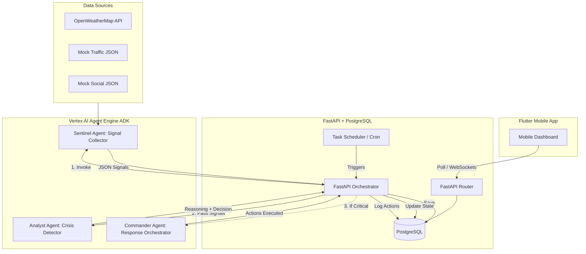
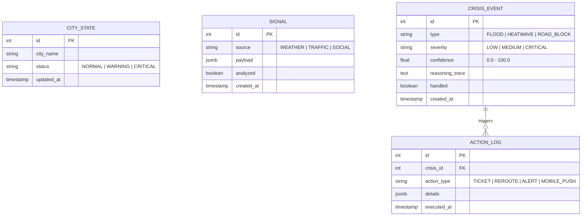

# CIRO (Crisis Intelligence & Response Orchestrator) Architecture Plan

This document outlines the architecture for the CIRO system, designed specifically for a 6-day hackathon timeframe, prioritizing demo reliability, clear traceability for judges, and simplicity.

## 1. System Architecture Overview

The system uses a Blackboard pattern where PostgreSQL serves as the central state mechanism, orchestrated by FastAPI, while Vertex AI Agent Engine handles the intelligent reasoning.

## 2. Agent Communication Pattern

**Recommendation:** **Database-Backed Blackboard Pattern orchestrated by FastAPI.**

*   **Why not pure Agent Engine chaining?** While Vertex AI allows agents to pass messages directly, using PostgreSQL as an intermediary "Blackboard" provides absolute, verifiable proof of state changes for the judges. If the demo fails mid-way, the database retains the exact state. 
*   **How it works:**
    1.  **FastAPI Scheduler** wakes up and triggers the **Sentinel** via the Vertex AI SDK.
    2.  Sentinel fetches data, formats it, and returns it to FastAPI. FastAPI saves these to the `signals` table.
    3.  FastAPI immediately triggers the **Analyst**, passing the new unanalyzed signals.
    4.  Analyst returns a structured evaluation. FastAPI writes this to the `crisis_events` table.
    5.  If the event is `critical` and `confidence > 80%`, FastAPI triggers the **Commander**, passing the crisis ID.
    6.  Commander executes its ADK tools (updating DB state, creating alerts).

## 3. Database Schema & State Management

### State Management: Before & After
The core of the demo relies on the `city_states` table.
*   **Before (Normal):** `status: "NORMAL"`, `active_crises: 0`, `traffic_rerouted: false`
*   **After (Crisis):** `status: "CRITICAL"`, `active_crises: 1`, `traffic_rerouted: true`, `last_alert_id: 104`

### Schema Diagram

## 4. FastAPI Role & Endpoints

FastAPI acts as the bridge between the database, the Flutter app, and Vertex AI. It is NOT the brain; it is the nervous system.

**Key Endpoints:**
*   `GET /api/v1/state`: Returns the current `CityState` and active `CrisisEvent`s for the Flutter app.
*   `GET /api/v1/feed`: Returns the stream of `ActionLog`s and `Signal`s for the mobile UI.
*   `POST /api/v1/demo/trigger-crisis`: **(CRITICAL FOR DEMO)** Overrides mock data files to force a critical scenario.
*   `POST /api/v1/orchestrator/run`: Manually triggers the agent pipeline (useful if the cron job is disabled for the live demo).

## 5. Mock Data Strategy & Demo Trigger

**Strategy:** Local JSON files mounted on the FastAPI server.
*   **Why?** Database seeding takes time to reset. External buckets add network latency risks on stage. Local JSON files are instantaneous and foolproof.

**Demo Trigger Mechanism:**
1.  FastAPI holds two sets of JSON files: `traffic_normal.json` and `traffic_crisis.json`.
2.  Normally, Sentinel reads from `traffic_normal.json`.
3.  During the demo, you click a hidden button in the Flutter app or hit the API endpoint `/api/v1/demo/trigger-crisis`.
4.  FastAPI instantly swaps the symlink or internal pointer to `traffic_crisis.json`.
5.  On the next tick (or manual trigger), Sentinel ingests the crisis data, kicking off the chain.

## 6. Traceability for Judges

Judges need to see *how* the AI made its decision.

1.  **Vertex AI Cloud Logging:** ADK automatically logs tool calls and LLM prompts/responses to Google Cloud Logging. You can filter by `resource.type="aiplatform.googleapis.com/Endpoint"` to show live traces on the big screen.
2.  **Database Traceability (The Backup):** The `Analyst` agent must be prompted to output a specific JSON schema that includes a `reasoning` field.
    *   *Example output:* `{"severity": "critical", "confidence": 92.5, "reasoning": "Detected 3 clustered social media reports of knee-deep water matching a sudden 40mm rainfall spike in OWM data for Sector G-11. Road blockage highly probable."}`
    *   FastAPI saves this exact string into the `CRISIS_EVENT.reasoning_trace` column, which the Flutter app displays.

## 7. Deployment Workflow (6-Day Timeline)

Keep it brutally simple. No Kubernetes, no complex Terraform.

1.  **Local Development:** Use Antigravity to generate the boilerplate FastAPI and Flutter code. Test agents locally using Vertex AI credentials (`gcloud auth application-default login`).
2.  **Backend Deployment:** Deploy FastAPI + PostgreSQL to a single **Google Compute Engine (GCE) VM** or **Cloud Run**. Cloud Run is preferred for ease, combined with Cloud SQL for PostgreSQL.
3.  **Agent Deployment:** Agents built with ADK are deployed to the Vertex AI Agent Engine. Maintain a Python script `deploy_agents.py` that registers the tools and agent instructions to Vertex AI via the SDK.
4.  **Mobile:** Run Flutter in an emulator connected to the Cloud Run URL for the demo, or build an APK and screen-mirror your phone.

## 8. Risks & Mitigations

| Risk | Impact | Mitigation |
| :--- | :--- | :--- |
| **Agent Hallucination** | High (Commander takes wrong action) | Strict Pydantic output schemas for the Analyst agent. If output parsing fails, default to 'LOW' severity. |
| **Vertex AI Latency** | Medium (Demo drags on) | Don't rely on 5-minute cron for the demo. Use a manual `Execute Pipeline` button to immediately trigger the Sentinel -> Analyst -> Commander chain. |
| **Stage Wi-Fi Fails** | Fatal | Cache the last known good state in the Flutter app. Have a fully local video recording of the demo as a fallback. |
| **Over-engineering** | High | Do NOT build user authentication. Do NOT build complex settings pages. Focus 100% on the core data flow and the visual wow-factor of the before/after state. |
